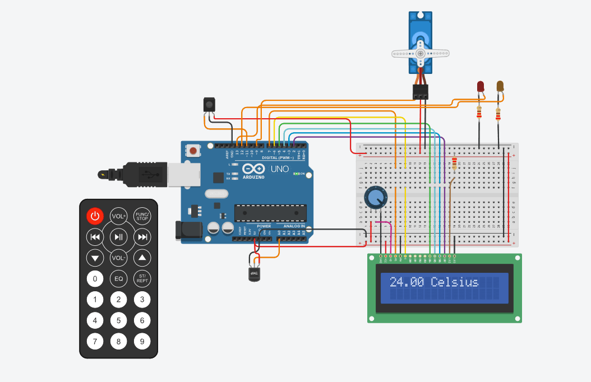

# Descripción
Mediante el uso de
+ 1 servomotor  
+ 1 placa de arduino
+ 1 lcd 16x2
+ 1 sensor IR
+ 1 Control remoto
+ 2 leds
Se lleva a cabo el desarrollo del proyecto de un sistema de incendio que nos
permite detectar cambios de temperatura y activar el servomotor cuando se detecta
un incendio. Mostrando por un display la temperatura actual y la estacion del año. 

#Funcionalidades extra:
+ Se prende un led rojo cuando se activa la alarma el cual es apagado cuando
se desactiva la misma.
+ Si la temperatura esta en un rango de -40 grados a -1 grado, presionando el boton 2
del control remoto nos devuelve un mensaje que dice "Frio critico" y enciende un 
led naranja que sera apagado cuando se suba la temperatura y se presione nuevamente el boton 2.


## Proyecto : Sistema de incendio con arduino.



## Funciones principales.

### "mostrarTemperatura(temperatura)"
Limpia el lcd setea el cursor en la posicion (0,0) printea la temperatura con un mensaje
que indica que son grados Celsius.

```C++
void mostrarTemperatura(float temperatura){
    displayLcd.clear();
    displayLcd.setCursor(0,0);
    displayLcd.print(temperatura);
    displayLcd.print(" Celsius");
  }
```


### "estacion(temperatura)"
Mediante rangos de temperatura indica a que estacion del año corresponde esa temperatura

```C++
void estacion(float temperatura)
{
  if (temperatura >= -40.0 && temperatura < 10.0)
  {
    displayLcd.clear();
    displayLcd.setCursor(0, 0);
    displayLcd.print(temperatura);
    displayLcd.print(" Celsius");
    displayLcd.setCursor(0, 1);
    displayLcd.print("Invierno");
  }
  else if (temperatura >= 10.0 && temperatura < 15.0)
  {
    displayLcd.clear();
    displayLcd.setCursor(0, 0);
    displayLcd.print(temperatura);
    displayLcd.print(" Celsius");
    displayLcd.setCursor(0, 1);
    displayLcd.print("Otoño");
  }
  else if (temperatura >= 15.0 && temperatura < 25.0)
  {
    displayLcd.clear();
    displayLcd.setCursor(0, 0);
    displayLcd.print(temperatura);
    displayLcd.print(" Celsius");
    displayLcd.setCursor(0, 1);
    displayLcd.print("Primavera");
  }
  else if (temperatura >= 25.0 && temperatura <= 59.0)
  {
    displayLcd.clear();
    displayLcd.setCursor(0, 0);
    displayLcd.print(temperatura);
    displayLcd.print(" Celsius");
    displayLcd.setCursor(0, 1);
    displayLcd.print("Verano");
  }
  else if (temperatura >= 60.0 && temperatura < 125.0)
  {
    displayLcd.clear();
    displayLcd.setCursor(0, 0);
    displayLcd.print(temperatura);
    displayLcd.print(" Celsius");
    displayLcd.setCursor(0, 1);
  }
}
```

### "prenderMiServo"
Si la temperatura es mayor o igual a 60 grados y menos a 125 grados prende el servo de 0° a 180° y viceversa, ademas
muestra un mensaje de ALARMA ACTIVADA
```C++
void prenderMiServo(float temperatura){
  if (temperatura >= 60.0 && temperatura < 125.0){
    
    displayLcd.clear();
    displayLcd.setCursor(0,0);
    displayLcd.print("ALARMA ACTIVADA");
    
    for (int angulo = 0; angulo <= 180; angulo++) {
      miServo.write(angulo); 
      delay(15);  
    }
    for (int angulo = 180; angulo >= 0; angulo--) {
      miServo.write(angulo);  
      delay(15);  
    }
  }
}
```

### "apagarMiServo()"

Esta funcion apaga el servo motor y muestra un mensaje de ALARMA DESACTIVADA.
```C++
void {
  miServo.detach(); //apago servo
  displayLcd.clear();
  displayLcd.setCursor(0, 0);
  displayLcd.print("ALARMA DESACTIVADA"); 
}
```

### "prenderLedNaranja()"
Prende un led naranja.
```C++
void prenderLedNaranja()
{  
  digitalWrite(LED_NARANJA, HIGH);
  delay(500);  
}
```


### "apagarLedNaranja()"
Apaga un led naranja.
```C++
void apagarLedNaranja()
{  
  digitalWrite(LED_NARANJA, LOW);
  delay(500); 
}
```


### "(prenderLedRojo())"
Prende un led rojo.
```C++
void prenderLedRojo()
{
  digitalWrite(LED_ROJO, HIGH);  
  delay(500);                  
}
```


### "(apagarLedRojo())"
Apaga un led rojo.
```C++
void apagarLedRojo()
{
  digitalWrite(LED_ROJO, LOW);
  delay(500); 
}
```


## Link al proyecto en Tinkercad .
* [Sistema de incendio con arduino](https://www.tinkercad.com/things/43lA6GC9jwC-segundo-parcial-spd/editel)

